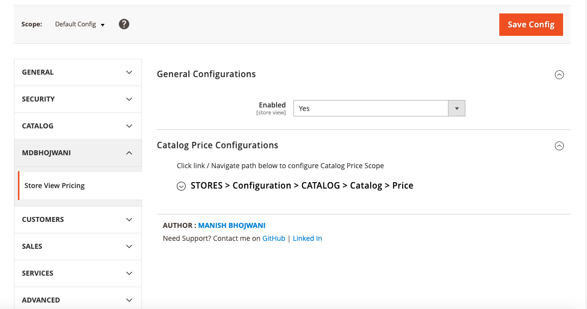
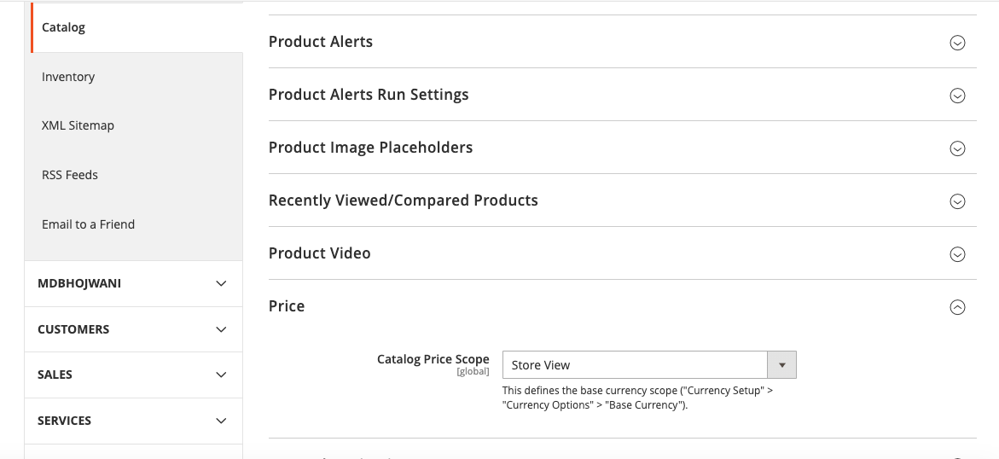

<strong>Mdbhojwani_StorePricing</strong> 

## Table of contents

- [Summary](#summary)
- [Installation](#installation)
- [Configurations](#configurations)
- [License](#license)

## Summary

Module is used to set different product prices or sale prices for each store. Store Manager can sell the products with different prices across each store.

## Installation

```
composer require mdbhojwani/magento2-store-view-pricing
bin/magento module:enable Mdbhojwani_StorePricing
bin/magento setup:upgrade
bin/magento setup:di:compile
bin/magento setup:static-content:deploy -f
bin/magento cache:clean
bin/magento cache:flush
```

## Configurations

```
1. Login to Magento Backend
2. Navigate to Store > Configurations > Mdbhojwani > Store View Pricing
3. Enable the Module and Catalog Price Scope to 'Store View'
```
- Module Configuration


<br />
- Catalog Price Scope Configuration


<br />
- Update Catalog Product Price on Store View


## License

[Open Software License ("OSL") v. 3.0](https://opensource.org/license/osl-3-0-php)
